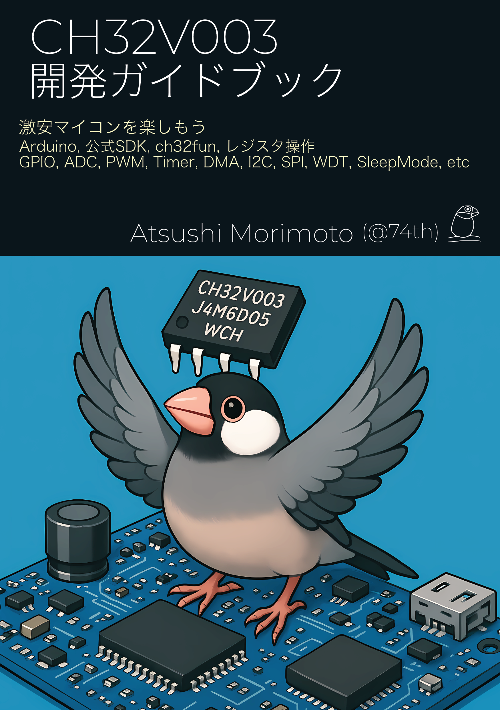

# CH32V003開発ガイドブック Arduino抜粋版

本サイトは技術同人誌『CH32V003開発ガイドブック』の中から、Arduinoについて抜粋し、さらにArduinoの利用に便利なように追記したものです。
とっつきにくいCH32V003にふれるファーストステップとしてArduinoを活用してもらいたく、Arduinoに絞った内容を無料で公開することにしました。
本サイトをきっかけに、CH32V003に興味を持っていただければ幸いです。

CH32V003について、さらに使いこなしたいと思った場合には、元の書籍『CH32V003開発ガイドブック』をお求めいただければ幸いです。
『CH32V003開発ガイドブック』の販売ページはこちらです。

> CH32V003開発ガイドブック[74TH-B018] - 74th Books & Gadgets - BOOTH [https://74th.booth.pm/items/6934072](https://74th.booth.pm/items/6934072)

元本では、公式SDK、ch32fun、直接レジスタを操作する方法など、CH32V003の開発について幅広く解説しています。
公式SDKとレジスタ操作が必要な、『DMAとTimer』『WatchDogTimer』『省エネルギーモード』については、抜粋版には記載がありません。
元の本を参照をお願いします。

## まえがき

CH32V003はWCHが開発した非常に安価なRISC-V MCUです。
筆者は、様々な電子工作の製作に、コストを気にせずに組み込んでいます。
CH32V003を使い始めて2年以上が経ちましたが、今や筆者の電子工作に欠かせない存在となっています。

UIAPさんが、CH32V003を使った開発ボードを頒布し、CH32V003での開発の敷居を下げてくれています。
そこでより開発に便利なように、CH32V003について私の書籍から、Arduinoの部分を抜粋した部分が公開されていると活用できると思い、本サイトを作成しました。
もしよりCH32V003を深く開発したいと思っていただいたり、よりCH32V003の開発について知りたいと思っていただけならば、元の書籍を購入していただければ幸いです。

## おことわり

本サイトは2025年5月31日に発刊した技術同人誌『CH32V003開発ガイドブック』の内容を元にしています。
掲載内容の多くは、執筆時点のものとなります。

## リポジトリ

このドキュメントは、GitHubのリポジトリで公開しております。

> 74th/ch32v003-guidebook-arduino: CH32V003開発ガイドブック Arduino抜粋版 [https://github.com/74th/ch32v003-guidebook-arduino](https://github.com/74th/ch32v003-guidebook-arduino)

## 本書の著作権について

全て Atsushi Morimoto (74th) に帰属します。

引用等は構いませんが、本書全体のWebへの転載はご遠慮ください。
こちらのページを見ていただくようにお願いします。

本サイトの内容を変更しない、本サイト全体のPDF、印刷物等の配布はOKです。
ただし、本サイトのArduino抜粋版のみを許可します。
元の書籍『CH32V003開発ガイドブック』は再配布の許可の範囲外となります。

右上のプリンターアイコンから、印刷ができます。
またWindows/MacOSであればPDFとして保存できます。
