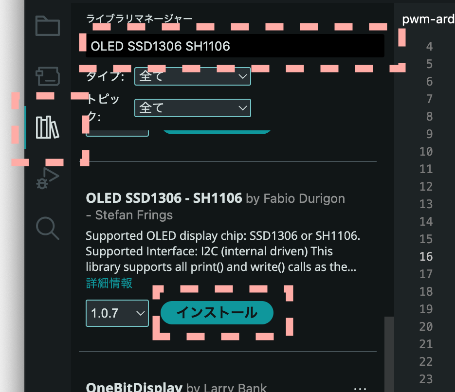

# 11. NeoPixelとOLED SSD1306の制御

SSD1306はOLEDディスプレイ用のドライバICで、I2CやSPIで制御可能な小型ディスプレイです。
非常に安価で、文字、グラフ、画像などを簡単に表示できるため、電子工作で広く利用されています。
このデバイスの使用方法を解説します。

## 11.1. OLED SSD1306

<figure class="wide">

<figcaption>I2C接続のSSD1306 OLEDモジュール</figcaption>
</figure>

小型OLEDディスプレイで広く使われているドライバIC、SSD1306の使用方法を説明します。

## 11.2. Arduino

Arduinoでの開発方法を解説します。
サンプルコードは以下のリポジトリにあります。

> [https://github.com/74th/ch32v003-book-code/tree/main/i2c_oled-arduino_core_ch32](https://github.com/74th/ch32v003-book-code/tree/main/i2c_oled-arduino_core_ch32)

Arduino Core CH32環境では、Adafruit GFXライブラリと互換性のある「OLED SSD1306 - SH1106」ライブラリが利用可能です。
このライブラリを使用した制御方法を説明します。

> OLED SSD1306 - SH1106 - Arduino Reference<br/>[https://reference.arduino.cc/reference/en/libraries/oled-ssd1306-sh1106/](https://reference.arduino.cc/reference/en/libraries/oled-ssd1306-sh1106/)

まず、Arduino IDEのライブラリマネージャを使用してこのライブラリをインストールします。
ライブラリマネージャで「OLED SSD1306 SH1106」と検索し、表示される「OLED SSD1306 - SH1106」を選択してインストールしてください。

<figure class="wide">

<figcaption>Arduino IDEライブラリマネージャでのSSD1306ライブラリインストール</figcaption>
</figure>

インストール後、スケッチメニューの「ライブラリをインクルード」から「OLED SSD1306 - SH1106」を選択して、ヘッダーファイルをインクルードします。

`OLED`クラスのオブジェクトを、使用するピンやディスプレイ設定と共に定義し、`setup()`関数内で`oled.begin()`を呼び出して初期化します。

```c
#include <oled.h>

// OLEDオブジェクトの定義
OLED oled = OLED(
  PC1, // SDAピン
  PC2, // SCLピン
  NO_RESET_PIN, // リセットピン
  OLED::W_128, // 幅
  OLED::H_32, // 高さ
  OLED::CTRL_SSD1306, // コントローラ
  0x3c // I2Cアドレス
);

void setup()
{
  // OLEDの初期化
  oled.begin();
}
```

コンストラクタの引数`PC1`, `PC2`は、それぞれI2CのSDA、SCLピンに対応するGPIOピン番号です。
`NO_RESET_PIN`は、リセットピンを使用しない場合に指定します。
`OLED::W_128`, `OLED::H_32`は、ディスプレイの幅と高さをピクセル単位で指定します。
`OLED::CTRL_SSD1306`は、使用するディスプレイコントローラICの種類を指定します。
最後の`0x3c`は、OLEDモジュールのI2Cスレーブアドレスです。

筆者が試した128x64ピクセルのOLEDモジュールでは、`OLED::H_64`を指定すると正常に動作しませんでした。
このライブラリは、ディスプレイの内容を保持するための内部バッファを持っています。
128x64ピクセルの場合、1KB（128 \* 64 / 8）のバッファが必要となり、CH32V003の限られたRAM（2KB）ではメモリ不足になる可能性があります。

このライブラリには、文字、画像、図形を描画するための基本的な関数が一通り用意されています。
描画関数を呼び出すと内部バッファが更新され、`oled.display()`を実行することでバッファの内容が実際のOLEDスクリーンに転送・表示されます。

`printf`ライクな書式指定でテキストを表示する関数も用意されており、便利です。

```c
// 描画バッファをクリア
oled.clear();
// 座標を指定して文字列を描画
oled.draw_string(60, 8, "@74th");
// カーソル位置を設定してprintf形式で文字列を描画
oled.setCursor(60,16);
oled.printf("CH32V003");
// 矩形を描画
oled.draw_rectangle(50, 6, 120, 26);
// 描画バッファの内容をOLEDに転送
oled.display();
```

ビットマップ画像を表示するには、画像データをC言語の配列形式に変換する必要があります。
筆者は以下のオンラインツールを使用して変換しました。

> image2cpp<br/>[https://javl.github.io/image2cpp/](https://javl.github.io/image2cpp/)

このツールでモノクロPNG画像をアップロードし、以下の設定でバイト配列を生成しました。

- Code output format: Plain bytes
- Draw mode: Vertical, 1 bit per pixel

生成されたバイト列データを、以下のようにC言語の`uint8_t`配列として定義します。

```c
// モノクロビットマップデータ (縦方向、1ピクセル1ビット)
static const uint8_t BUNCHO_74TH[] =
  {
    0xff, 0xff, 0xff, 0xff,
    // ... (データ省略) ...
    0xb7, 0xb7, 0xbf, 0xff};

```

この配列データを引数として、`draw_bitmap_P`関数を呼び出して描画します。

```c
// ビットマップ画像を描画バッファに描画 (PROGMEMから読み込み)
oled.draw_bitmap_P(0, 0, 32, 32, BUNCHO_74TH);
// 描画バッファの内容をOLEDに転送
oled.display();
```
