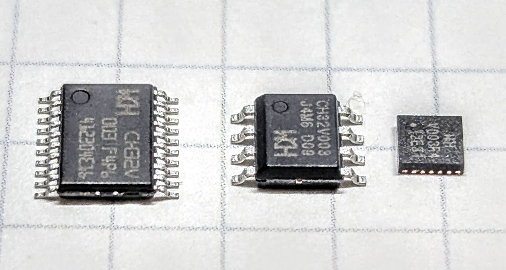
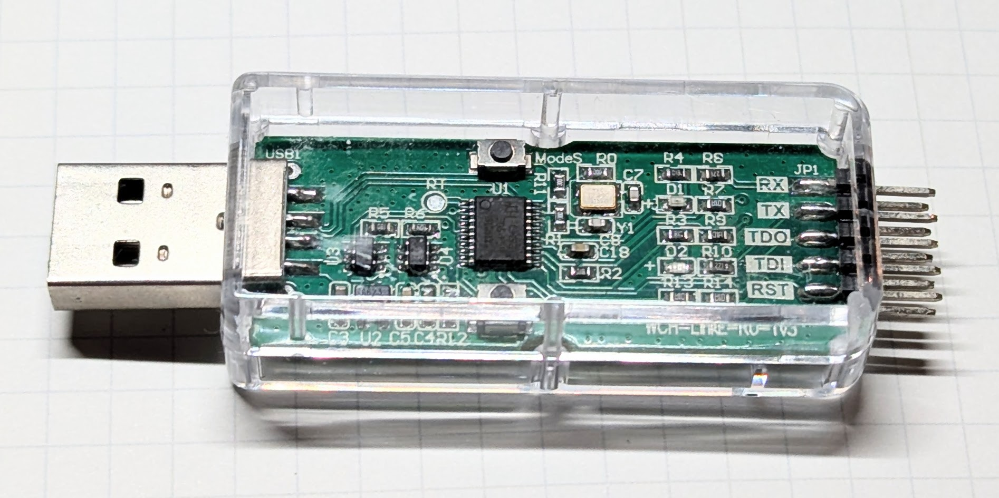
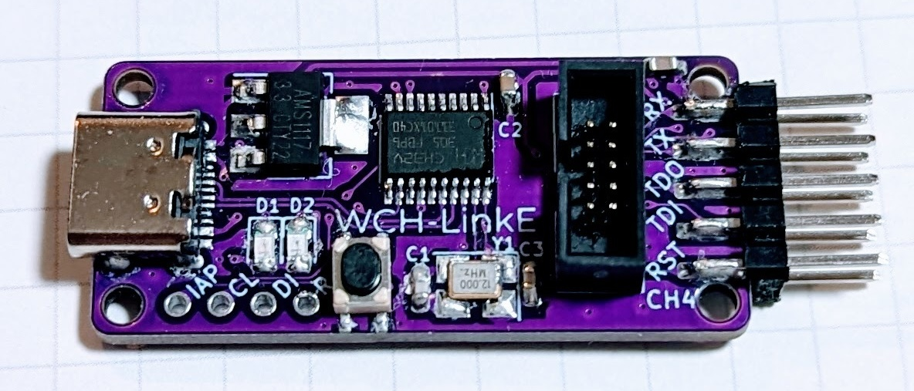
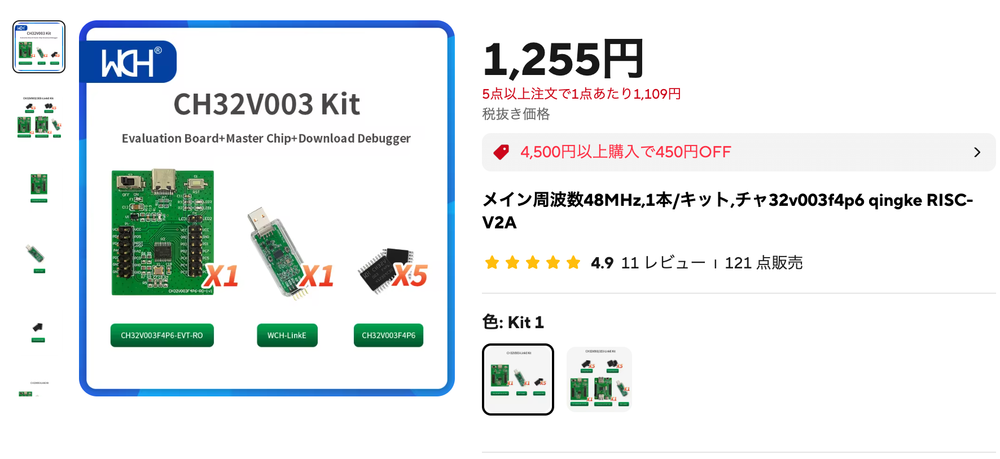
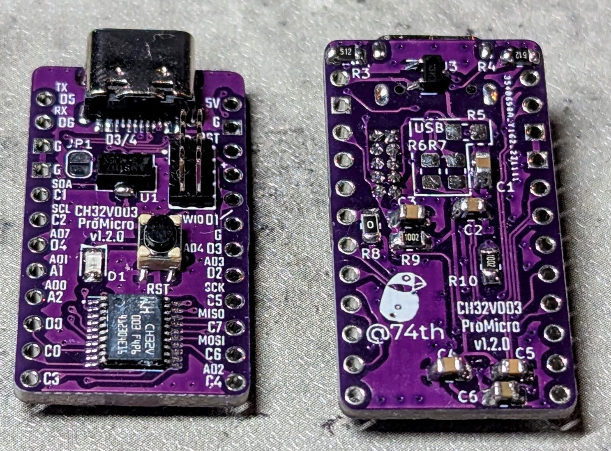
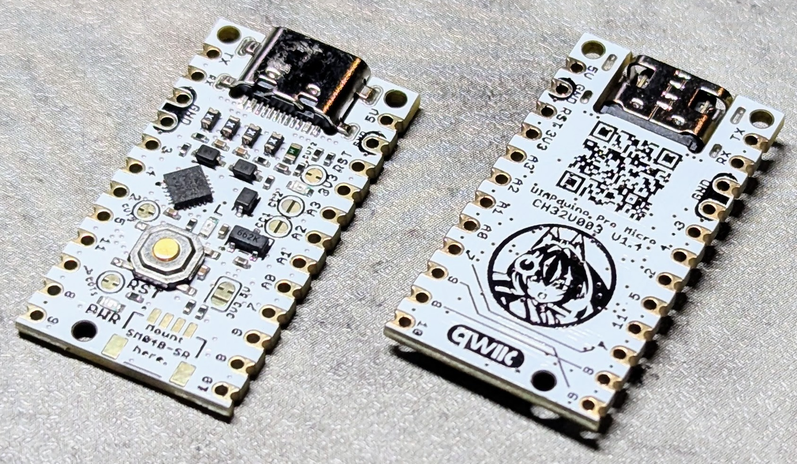

# 12. CH32V003の魅力と基礎知識

最後に、本サイトで取り扱ったCH32V003について解説します。

元の本の、最初の章で解説している内容と同じものです。

## 12.1. CH32V003とは

CH32V003はWCH社が発売する格安32bit RISC-V MCUです。

<figure class="wide">

<figcaption>CH32V003</figcaption>
</figure>

WCH社は、STM32に機能を似せた機能を持った32bit RISC-V MCUとして、CH32Vシリーズを発売しています。
その中でもCH32V003は、秋月電子通商でも1個40円で販売される格安MCUです。
公式ショップから購入すると、1個25円で18ものGPIOをもつMCUが購入できます。
格安にもかかわらずSTM32のようにPeripheralが豊富で、UART、I2C、SPI、GPIO、ADC、PWMなどの機能を持っています。
筆者は簡単な機能でも汎用的に組み込むMCUとして使っています。

主な特徴は以下の通りです。

- とにかく安い
- 電源が3-5Vで動作
- 32bit RISC-Vで、命令セットはRV32EC
  - 圧縮命令セット。整数の乗算、除算、浮動小数点はない。
- RAM 2kB、Code FLASH 16kBととにかく小さい
- STM32系を模したPeripheralで、機能も豊富
  - Timer、GPIO、UART、I2C、SPI、ADC、PWM、DMA、WDTなど
- 単線SWIOで書き込みが可能
- 動作に必要な追加部品が少ない

各パッケージ毎の機能リストは以下の通りです。

| Model        | Code Flash | RAM | GPIO | Timer | ADC | SPI | I2C | UART | Package  |
| ------------ | ---------- | --- | ---- | ----- | --- | --- | --- | ---- | -------- |
| CH32V003F4P6 | 16k        | 2k  | 18   | 1+1   | 8   | 1   | 1   | 1    | TSSOP-20 |
| CH32V003F4U6 | 16k        | 2k  | 18   | 1+1   | 8   | 1   | 1   | 1    | QFN-20   |
| CH32V003A4M6 | 16k        | 2k  | 14   | 1+1   | 8   | -   | 1   | 1    | SOP-16   |
| CH32V003J4M6 | 16k        | 2k  | 6    | 1+1   | 8   | -   | 1   | 1    | SOP-8    |

TSSOP-20（0.65mmピッチ20ピン）のパッケージがピン数も多く、手はんだでも難しくはないため電子工作にお勧めです。
TSSOP-20のDIP化PCBは秋月電子通商でも販売されています。
SOP-8（1.27mmピッチ8ピン）のパッケージは、ピッチ幅も広く実装もしやすいですが、後述しますがいくつか注意が必要な点があります。

QFN20（0.4mmピッチ20ピン）のパッケージは、ICサイズも3.0mm×3.0mmととても小さく、小さい(狭い)場所への組み込みに向いています。
裏面パッドがあるためはんだごてでは実装できません。
リフロー機材を使ったり、PCBAサービスを利用する場合には良いでしょう。

## 12.2. CH32V003のMCU単体の入手方法

WCH社の公式ショップがAliexpressに出店しており、そこから購入することができます。
そこでは50個単位での購入となりますが、2025年4月現在送料を含めて1,200円ほどで購入できます。

> 50 ピース/ロット CH32V003 工業グレード MCU、RISC-V2A、単線シリアル デバッグ インターフェイス、システム周波数 48MHz - AliExpress<br/>[https://ja.aliexpress.com/item/1005005036714708.html](https://ja.aliexpress.com/item/1005005036714708.html)

秋月電子通商でも、TSSOP-20（0.65mmピッチ20ピン）のCH32V003F4P6が1個50円、SOP-8（1.27mmピッチ8ピン）のCH32V003J4M6が40円で購入できます。

> 32ビットRISC-Vマイコン CH32V003F4P6: 半導体 秋月電子通商-電子部品・ネット通販<br/>[https://akizukidenshi.com/catalog/g/g118061/](https://akizukidenshi.com/catalog/g/g118061/)

50個単位での購入でも高くないので、ひとまずまとまった数を購入してみると良いでしょう。
Aliexpressで購入した場合でも1〜2週間程度で到着します。

## 12.3. 最小限の回路

CH32V003を最小限動作させる回路は以下のようになります。

<figure class="wide">

<figcaption>CH32V003の最小限の回路</figcaption>
</figure>

ポイントは以下となります。

- VDDに、3.3Vまたは5Vを接続
- GNDに、GNDを接続
- VDDに、100nFのコンデンサをデカップリングコンデンサとして接続

このように追加部品は100nFのコンデンサのみとなっています。

## 12.4. ファームウェア開発の方法

開発の方法を「ファームウェアプログラマ」「ファームウェアライブラリ」「エディタ・IDE」の順に説明します。

### ファームウェアプログラマ

ファームウェアの書き込みには、専用のツールWCH-LinkEが必要です。
WCH-Linkという姉妹品も発売されていますが、末尾にEの付いたWCH-LinkEでなければ書き込めません。
WCH-LinkEの代わりになるプログラマが複数開発されています。
ESP32S2を使った「esp32s2-funprog」、STM32F042を使った「NHC-Link042」、RP2040を使った「picorvd」などです。
しかし、日本国内においてはWCH-LinkEが安価に手に入ること、代替ツールでは全ての機能が使えるわけではないことから、WCH-LinkEを購入することをお勧めします。

<figure class="wide">

<figcaption>WCH-LinkE</figcaption>
</figure>

WCH-LinkEは秋月電子通商で、1,000円ほどで購入することができます。

> WCH-LinkEエミュレーター: 開発ツール・ボード 秋月電子通商-電子部品・ネット通販<br/>[https://akizukidenshi.com/catalog/g/g118065/](https://akizukidenshi.com/catalog/g/g118065/)

AliexpressでWHC-LinkEと評価ボード、MCUのセットが販売しています。
こちらを購入しても良いでしょう。

> メイン周波数48MHz,1本/キット,ch32v003f4p6 qingke RISC-V2A - AliExpress<br/>[https://ja.aliexpress.com/item/1005004895791296.html](https://ja.aliexpress.com/item/1005004895791296.html)

筆者のBoothショップでもクローン品を作成し販売しております。
CH32V003開発ボードキットを発売した当初、まだ国内でWCH-LinkEが入手できなかったため、作成し、販売していました。
よければこちらもお求めください。

<figure class="wide">

<figcaption>WCH-LinkEクローン</figcaption>
</figure>

> WCH-LinkEクローン USB-C,SWD10Pin(¥2,500) [74TH-G016] - 74th Books & Gadgets - BOOTH
> [https://74th.booth.pm/items/5022813](https://74th.booth.pm/items/5022813)

WCH-LinkEとCH32V003は、SWIOと呼ばれる、1本の線で書き込みができるシリアルインターフェースを使って接続します。
GNDとSWIOの2本の線を接続すれば書き込みができます。

### ファームウェアライブラリ

CH32V003のファームウェアを開発できるライブラリが複数あります。

#### 公式SDK (C/C++)

WCH社が公式に提供しているライブラリです。
古いSTM32のライブラリ(Standard Peripheral Library、以下SPL)を模したAPIを提供しています。

後ほど紹介するMounRiver Studioから利用できるようになっていますが、コード自体は以下のリポジトリで公開されています。
OSSとしてApache 2.0ライセンスで公開してくれています。

> [https://github.com/openwch/ch32v003/](https://github.com/openwch/ch32v003/)

STM32のSPLとほぼ同じAPIを提供しているため、STM32の解説書がCH32を利用する場合でも参考になります。

#### Arduino Core CH32 (C)

WCH社がWCH SDKをArduinoのAPIでラップし、Arduino IDEで開発できるようにArduinoライブラリを提供しています。

以下のリポジトリで公開されています。

> [https://github.com/openwch/arduino_core_ch32](https://github.com/openwch/arduino_core_ch32)

Arduinoは多くのサードパーティライブラリが活用できることも魅力の一つです。
しかし、それらの中にはArduino UNO R3など特定のボードのMCUに向けた仕様になっているものが多く、動作しない場合があります。

本サイトのArduinoでの開発の解説では、このWCH社が提供するArduinoライブラリの利用を前提に説明します。

#### ch32fun (C)

CH32V003はとてもFlash領域が少ないため、ライブラリでさえも容量を圧迫してしまいます。
容量節約のため、ch32funではレジスタを直接操作することを基本としています。
ファームウェア開発に集中できるように、ビルドや書き込み、ファームウェアのスタートアップ、デバッグプリントなどの開発に必要な機能をフルスタックで提供しています。

> Open source minimal stack for the ch32 line of WCH processors, including the ch32v003, a 10¢ 48 MHz RISC-V Microcontroller - as well as many other chips within the ch32v/x line.
> [https://github.com/cnlohr/ch32fun](https://github.com/cnlohr/ch32fun)

以前は、ch32funはch32v003funと呼ばれていました。

ch32funでの開発の基本はレジスタを直接操作することですが、一部便利なライブラリが提供されています。
また、リポジトリにはサンプルコードが多数コミットされており、難しいレジスタ操作ながら実際に動くコードを参照できるためたいへん便利です。

元の本では、レジスタを用いた方法も解説しています。
その際には開発環境としてch32funを利用します。

#### ch32-rs (Rust)

Rustでレジスタ操作でファームウェアを開発できるPeripheral Access Crateがch32-rsというOSSとして公開されています。

> Embedded Rust device crates for WCH's RISC-V and Cortex-M microcontrollers
> [https://github.com/ch32-rs/ch32-rs](https://github.com/ch32-rs/ch32-rs)

また、embedded-halとよばれる汎用API仕様でラップしたクレートも公開されています。
クレートは全ての機能を網羅できているわけではないため、必要に応じて利用を選択してください。

> ch32-rs/ch32v00x-hal: HAL for the CH32V003 family of microcontrollers
> [https://github.com/ch32-rs/ch32v00x-hal](https://github.com/ch32-rs/ch32v00x-hal)

第16章で、Rustでの環境構築について簡単に紹介します。

#### arduino-wch32v003 (C)

CH32V003で利用できるArduinoライブラリには、先ほど紹介したArduino Core CH32以外にもarduino-wch32v003があります。
ch32funをArduinoのAPIでラップした、OSSとなっています。

> [https://github.com/AlexanderMandera/arduino-wch32v003](https://github.com/AlexanderMandera/arduino-wch32v003)

### エディタ・IDE

これまで紹介したファームウェアライブラリで開発できるコードエディタを紹介します。

#### MounRiver Studio 2

WCH社の公式の開発環境として、MounRiver Studio 2が提供されています。
ファームウェアライブラリにはWCH SDKを利用します。

> MounRiver Studio<br/>[http://www.mounriver.com/](http://www.mounriver.com/)

MounRiver Studio 1では、Eclipseベースであり、対応OSではWindows(x64)のみが提供されていました。
MounRiver Studio 2からは、VS Codeベースに変更され、対応OSもWindows(x64)、macOS(aarch64、ただしコンパイラ等はx64)、Linux(x64)が提供されています。

元の本では、WCH SDKでの開発の章で詳しく使い方を説明しています。

#### Arduino IDE

Arduino Core CH32は、Arduino IDEで使うことができます。
これも第2章で詳しい使い方を説明しています。

#### PlatformIO (VS Code)

PlatformIOは、ファームウェア開発に必要なコンパイラやライブラリのセットアップ、書き込みといった作業を、一連の共通の操作で様々なMCUとフレームワークで行えるように整備された開発環境です。
VS Codeの拡張機能として動作します。

開発フレームワークとしては、WCH SDKとch32funに対応しています。
元の本では、WCH SDKでの開発の章で詳しく使い方を説明しています。

#### ch32funはVS Codeでも開発できる

ch32funは、ビルドはmakeを使って行うため、特にIDEは必要とはしません。
VS Code用の設定ファイルがテンプレートに含まれており、VS Codeでコード補完やデバッグ実行が利用でき、快適に開発できます。
筆者は、ch32funをVS Codeを用いて開発しています。

### ライブラリ、開発環境の使い分け

簡易な開発であればArduino Core CH32でも良いでしょう。
しかし、CH32V003の全ての機能を使おうと思うと、WCH SDKかレジスタを直接操作する方が良いです。
また、機能を作り込もうと思うと、Code FLASH容量不足から、Arduino Core CH32では生かしきれないことがあります。

より依存関係が少なくシンプルに作るならば、ch32funが良いでしょう。

### 書き込みツール

次にプログラマ（WCH-LinkE）をPCで操作するためのツールを紹介します。

#### WCH-Link Utility

公式のファームウェアの書き込みや設定の変更を、WCH-LinkEを介して行う公式GUIツールです。
対応OSはWindowsしかありませんが、GUIでファームウェアの書き込みや、消去、読み込みの他に、フラッシュの保護の解除など様々な操作ができます。
公式ツールなこともあり、最も安心して利用できるツールでしょう。

WCH-LinkEのファームウェアのアップデートもこのツールを介して行えます。

以下からダウンロードできます。

> WCH-LinkUtility.ZIP - 南京沁恒微电子股份有限公司
> [https://www.wch.cn/downloads/WCH-LinkUtility_ZIP.html](https://www.wch.cn/downloads/WCH-LinkUtility_ZIP.html)

#### OpenOCD

MounRiver StudioではCH32V開発用にフォークしたOpenOCDをメンテナンスしていて、ファームウェアの書き込み時には利用されています。
MounRiver Studio利用時のみ利用すれば良いでしょう。

#### wlink

wlinkは、Rust製のマルチプラットフォームに対応したツールで、WCH-LinkEを介して、ファームウェアの書き込み、消去などができます。
CH32VシリーズのRust用ライブラリのメンテナが製作しています。

> ch32-rs/wlink: An open source WCH-Link library/command line tool written in Rust.
> [https://github.com/ch32-rs/wlink](https://github.com/ch32-rs/wlink)

GitHubリポジトリにてビルド済みバイナリも公開されているため、ダウンロードして使うことができます。

> Releases · ch32-rs/wlink<br/>[https://github.com/ch32-rs/wlink/releases](https://github.com/ch32-rs/wlink/releases)

wlinkを使ってファームウェアを書き込むには以下のように実行します。

```sh
wlink flash ch32v003.bin
```

#### minichlink

minichlinkはマルチプラットフォームに対応したツールで、WCH-LinkEを介してファームウェアの書き込み、消去などができます。
ch32funのメンテナが製作しています。

ch32funのGitHubリポジトリからソースコードをチェックアウトして、自分でビルドして利用します。

```sh
git clone https://github.com/cnlohr/ch32fun.git
cd ch32fun/minichlink
make
```

minichlinkは、引数が`-b`といったフラグになっており、複数のフラグを設定すると設定順に実行される形になります。

例えば、書き込み`-w`後にリセット`-b`を行うには以下のようにします。
書き込みは`-w <ファイル名> <flash/bootloader>`のように、書き込むファイル名と書き込む領域を指定します。

```
minichlink -w ch32v003.bin flash -b
```

#### 使い分け

CUIで使えるツールとしては、minichlinkとwlinkのどちらも使えます。
minichlinkはch32funでの活用に特化されていて、wlinkはWCH Link Utilityでできることをそのまま実装しているように見えます。
筆者はシンプルさでいえばminichlinkの方が利用しやすいように思っています。

## 12.5. ひとまず動く開発ボードが欲しい

MCUが使える基盤を製作する前に、検証に使える開発ボードがあると便利です。
複数のCH32V003開発ボードが発売されています。

### WCH社公式評価ボード

WCH社の公式の評価ボードがあります。
先に説明したプログラマWCH-LinkEとセット販売がされています。

<figure class="wide">

<figcaption>公式評価ボード</figcaption>
</figure>

> メイン周波数48MHz,1本/キット,ch32v003f4p6 qingke RISC-V2A - AliExpress
> [https://ja.aliexpress.com/item/1005004895791296.html](https://ja.aliexpress.com/item/1005004895791296.html)

まずは1つ持っておくと便利です。

ただし、この開発ボードには水晶発振子が接続されています。
CH32V003を安価に使おうと思うと水晶発振子はコストになり内蔵発振子を使うことが多いです。
そのため、使わない水晶発振子に2ピンが割り当てられてしまうの、使えるピンが減るためもったいないです。

### 筆者作成のProMicro型ボード

<figure class="wide">

<figcaption>筆者作成のProMicro型ボード</figcaption>
</figure>

筆者が作成しているCH32V003のProMicro型ボードがあります。
ProMicro型ということで、ブレッドボードにも刺すことができ、便利です。
ProMicroとUART、I2C、SPIのピン配置を同じにしているため、ProMicroに慣れている方であればすぐに配線できると思います。

また、SWD10ピン端子を設けており、筆者の作成するWCH-LinkEクローン、WCH-LinkE Adapterを使うと、1つのケーブルで簡単にWCH-LinkEと配線できます。

こちらはBoothショップで、キットとして販売しています。

> CH32V003 ProMicroサイズ開発ボードキット (3個入¥1,500) [74TH-G015] - 74th Books & Gadgets - BOOTH<br/>[https://74th.booth.pm/items/4645948](https://74th.booth.pm/items/4645948)

設計ファイル（KiCad）はOSSHWとして公開しています。
ご自身でPCBファブリケータに発注して製造することも可能です。

> ch32v-dev-boards/ch32v003-promicro at main · 74th/ch32v-dev-boards<br/>[https://github.com/74th/ch32v-dev-boards/tree/main/ch32v003-promicro](https://github.com/74th/ch32v-dev-boards/tree/main/ch32v003-promicro)

### UIAPduino Pro Micro CH32V003

<figure class="wide">

<figcaption>UIAPduino Pro Micro CH32V003</figcaption>
</figure>

UIAPが開発するPro Micro型のCH32V003ボードです。
大きな特徴は、USB経由で書き込み可能な回路とブートローダを搭載していることです。

UIAPduino用のArduinoパッケージをインストールすることで、USB経由での書き込みがArduino IDEからできるようになります。

BOOTHショップやスイッチサイエンスで購入できます。

> UIAPduino Pro Micro CH32V003 V1.4 - UIAP - BOOTH<br/>[https://uiap.booth.pm/items/5845791](https://uiap.booth.pm/items/5845791)

### その他の開発ボード

ReAct Studioが作成した開発ボードが、国内のビットトレードワンで販売されています。
374円という非常に安価な価格で販売されています。

> WA00007 [Weact]CH32V003F4U6マイコンボード — ビット・トレード・ワン 公式オンラインショップ BTOS<br/>[https://btoshop.jp/products/wa00007](https://btoshop.jp/products/wa00007)

その他、AliexpressでもCH32V003の開発ボードが販売されています。
CH32V003で検索すると、多数見つかると思います。

## 12.6. CH32V003開発で知っておくと良いこと

### SOP-8のCH32V003J4M6のUSART TXとSWIOのピンの共用

SOP-8のCH32V003J4M6は、USART TXのピンがSWIOのピンと共用になっています。
そのため、USART TXを有効にすると、SWIOによる書き込みができなくなります。

回避方法としては、Remap機能を使って、USART TXをSWIOとは異なるピンで利用することが考えられます。
Remapの方法についてはUARTの第6章で説明します。
なお、Arduinoを利用している場合にはRemapはできません。

USART TXを有効にしてSWIOが使えなくなった場合は、以下に説明する「電源オン時のフラッシュ消去」を行って、ファームウェアを削除してから書き込む必要があります。

### 電源オン時のフラッシュ消去

CH32シリーズには、電源オン時にフラッシュメモリを消去するコマンドを受け付ける機能があります。

この操作は、複数のツールで対応しています。

#### WCH-Link Utilityの場合

タイトルバーメニューに"Target"→"Clear All Code Flash-by Poweroff"を実行します。

#### wlinkの場合

eraseコマンドに以下のように引数を指定します。

```
wlink erase --chip CH32V003 --method power-off
```

#### minichlinkの場合

フラグ`-u`を付けます。

```
minichlink -u
```

WCH-LinkEには5V、3.3Vの電源供給端子があります。
この端子にはスイッチ機能が付いており、コマンドで電源供給のオンオフを切り替えることができます。
上記のコマンドを使った場合、このスイッチ機能を使って電源供給が一時的に遮断され、オペレーションに成功します。

ただし、WCH-LinkEのクローン品にはこの電源のスイッチ機能が含まれていないことがあります。
実際に、筆者の作成するものや、MuseLabが作成するクローン品にはスイッチ機能は含まれていません。
手動で電源のオンオフをしても行えますが、WCH-LinkE経由で行った方が確実です。

### CPU命令セットに整数の乗算・除算がないが、ソフトウェアで使える

CH32V003のCPUの命令セットRV32ECには、整数の乗算・除算の命令がありません。
しかし、ソースコード上で乗算・除算を行った場合、コンパイラによってソフトウェア上で実装され、利用可能になります。

ch32funを使い、uint32_tやfloatの乗算・除算を行った場合のファームウェアサイズを比較しました。

|                     | printf未使用(B) | printf使用(B) |
| ------------------- | --------------: | ------------: |
| 乗算/除算なし       |             588 |         1,916 |
| uint32_tの乗算      |             624 |         1,948 |
| uint32_tの除算      |             728 |         1,924 |
| uint32_tの乗算/除算 |             760 |         1,956 |
| floatの乗算         |           1,724 |         3,228 |
| floatの除算         |           1,960 |         3,332 |
| floatの乗算/除算    |           2,592 |         3,972 |

フラッシュの消費容量は、uint32_tの乗算・除算ではそれほど増えませんが、floatの乗算、除算を組み込むと大きくなるのが分かります。

また、printfを使わないことでもフラッシュ容量の削減になります。

### WCH-LinkEには、DapLinkモードがある

WCH-LinkEは、ARM MCUのデバッガであるDapLinkとして動かすDAPモードと、WCHのRISC-V MCU用に動かすRVモードがあります。
WCH-LinkE上に青色のLEDが点灯しているときは、DapLinkモードになっています。
一度切り替えると、USBケーブルを抜き差ししてもそのモードが維持されます。

モードを切り替える方法はいくつかあります。
ひとつはModeSと書かれた物理ボタンを押しながら、USBケーブルを挿す方法です。
しかし、WCH-LinkEはプラスチックのケースに覆われており、ケースを取り外さないと挿せません。

wlink、WCH Link Utility、MounRiver StudioのDownload Configurationの機能を使うとケースを取り外さないでも切り替えることができます。
WCH Link Utility、MounRiver StudioではGUIで操作できますが、手軽に行うにはwlinkを使うと良いでしょう。
wlinkでは以下を実行して切り替えることができます。

```
# CH32V用のRVモードにする
wlink mode-switch --rv

# ARM用のDAPモードにする
wlink mode-switch --dap
```

## 12.7. 後継、類似モデル

### CH32V002、CH32V006

現在、CH32V002、CH32V006というCH32V003の後継のMCUが発売されています。
機能の比較は以下の通りです。

| Series   | Core    | Code Flash | RAM | GPIO | Timer | ADC | SPI | I2C | UART |
| -------- | ------- | ---------- | --- | ---- | ----- | --- | --- | --- | ---- |
| CH32V003 | RV32EC  | 16k        | 2k  | 18   | 1+1   | 8   | 1   | 1   | 1    |
| CH32V002 | RV32EmC | 16k        | 4k  | 18   | 1+1   | 8+3 | 1   | 1   | 1    |
| CH32V006 | RV32EmC | 64k        | 8k  | 31   | 1+1   | 8+3 | 1   | 1   | 2    |

CH32V002はRAMが4kBと倍増しています。
CH32V006は上位モデルで、RAMが8kB、FLASHが64kBと4倍に増加しています。

CH32V002/CH32V006ではCPUコアがCH32VEmCに変更され、整数の乗算がサポートされるようになりました。
また、ADCも3チャンネル追加されたり、タッチセンサーに対応したりしています。
CH32V006は、GPIOの数も増え、UARTも2つに増えています。

また、動作電圧が2~5Vに対応しました。
2Vで動作するため、コイン電池でも動作します。
実際に筆者はコイン電池CR2032で動作するケーブルチェッカをCH32V002で作り、動作しました。

後継のものはグレードアップされていますが、値段はほぼ据え置かれています。
50個単位で購入すれば1000円台前半で入手できます。

ただ、2025年4月現在、まだ発売したばかりなのでいくつか問題もあります。
筆者の検証した限りは、CH32V002ではSWIO経由でのデバッグプリントであるSDI-Printが動作しませんでした。
ch32funは既にこれらのチップに対応していますが、現行のUbuntu 24.04 LTS付属のgccではRV32EmCに対応していないなど、完全に使える状態ではありません。
まだしばらくはCH32V003を使う方が安定して開発に取り組めると思っています。

### 他のCH32シリーズ

WCHはCH32シリーズとして、32ビットMCUを多数リリースしています。
CH32"V"がRISC-Vコアを搭載したシリーズで、CH32"F"がARMコアを搭載したシリーズです。
名前の通りSTM32シリーズのピンコンパチ品として開発がスタートされたようですが、現在は多様な製品が展開されています。

CH32V203は、CH32シリーズのフラグシップ的なモデルとなっています。
USBデバイス、ホストの機能を持っています。
国内でも秋月電子通商で販売されているため、手に入れやすいでしょう。

CH32X035は、RISC-VコアのMCUですが、いくつか特徴的な機能があります。
USBデバイス、ホストの機能に追加で、USB PDの制御機能も持っています。
さらに、プログラマブルIOコントローラPIOCを搭載しています。
価格もかなり抑えており、USBを使いたいのであれば最も安価なMCUの一つとなっています。

### USB、WiFi対応CH570

WCH社はWiFiに対応したMCUもリリースしています。
その中でも安価なCH570を発表しました。
価格は10セントで、CH32V003に近い価格です。

技適を取得していないため、日本国内では電子工作用途でのWiFi利用は難しいでしょう。

一方USBデバイス、ホストの機能も持っています。
Code Flashは240kB、RAMは12kBとかなり大きくなっています。
WiFiを利用しなくても、安価なUSBデバイス対応MCUとしても利用できることを期待しています。
