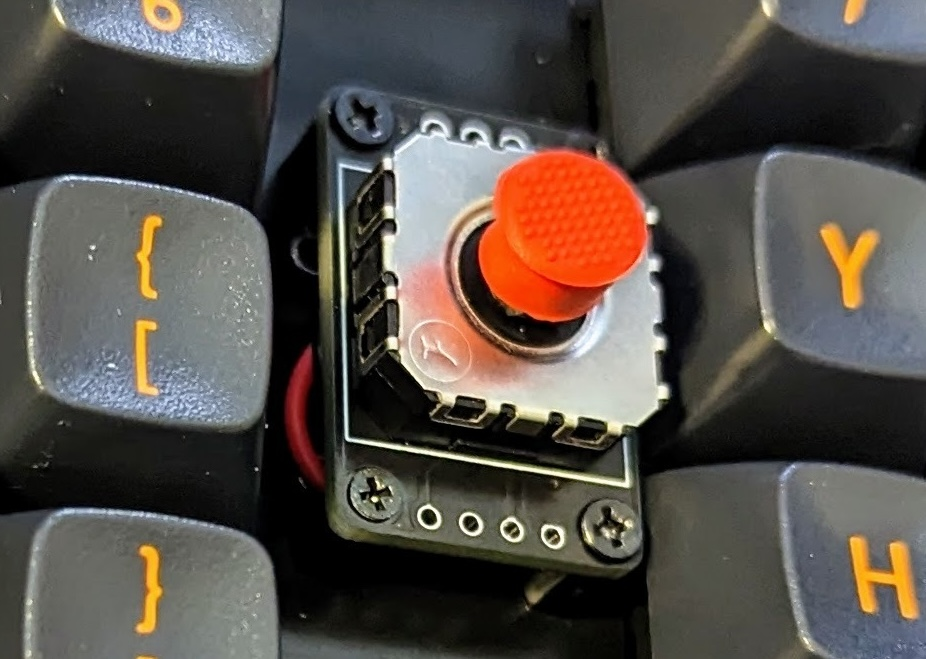
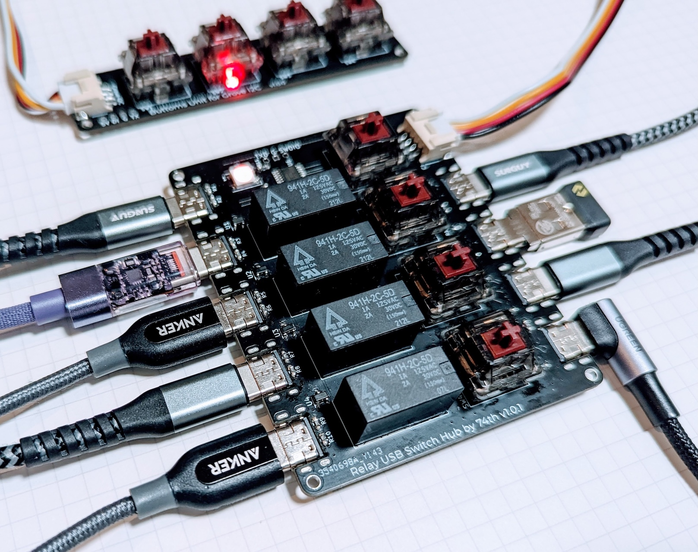
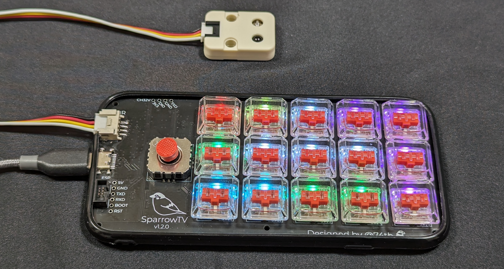
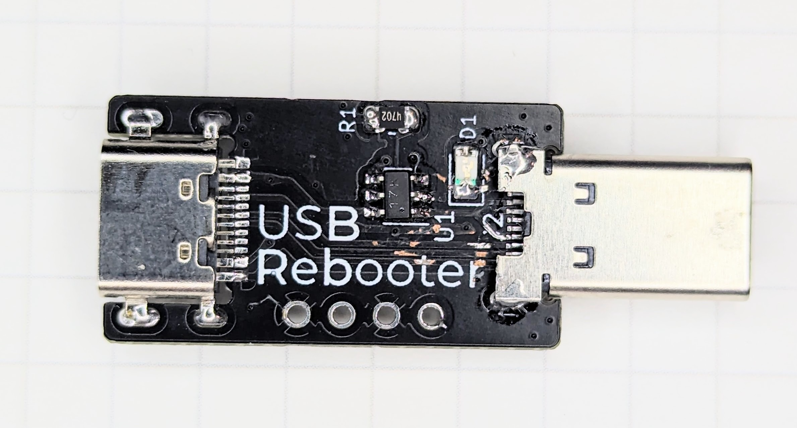
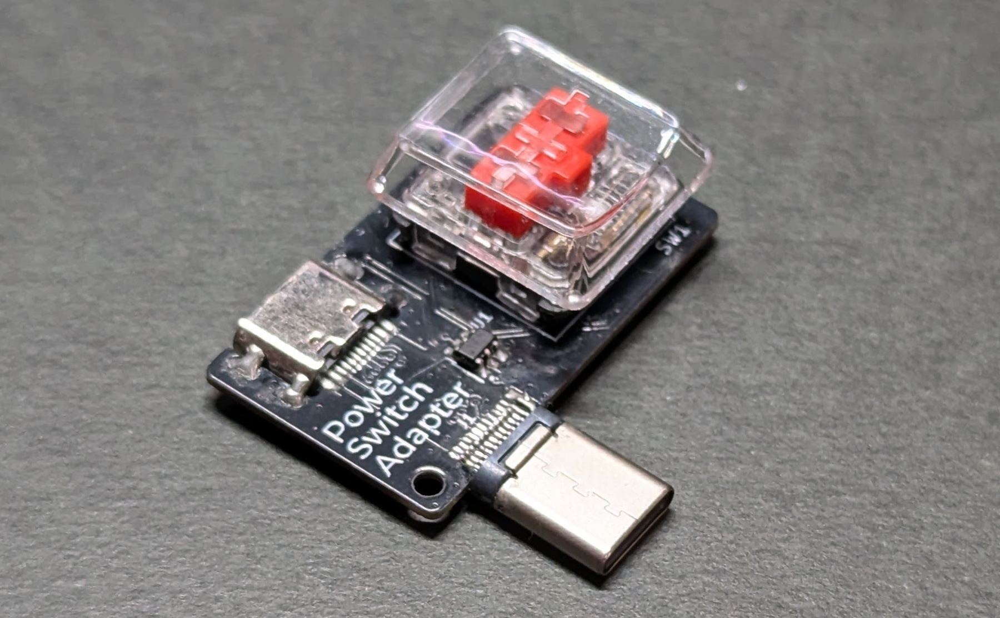
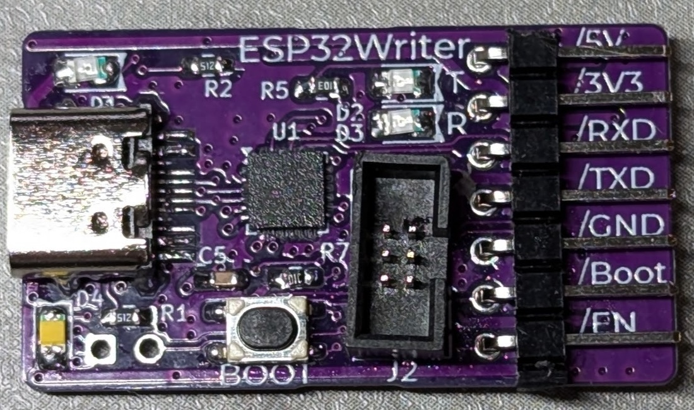
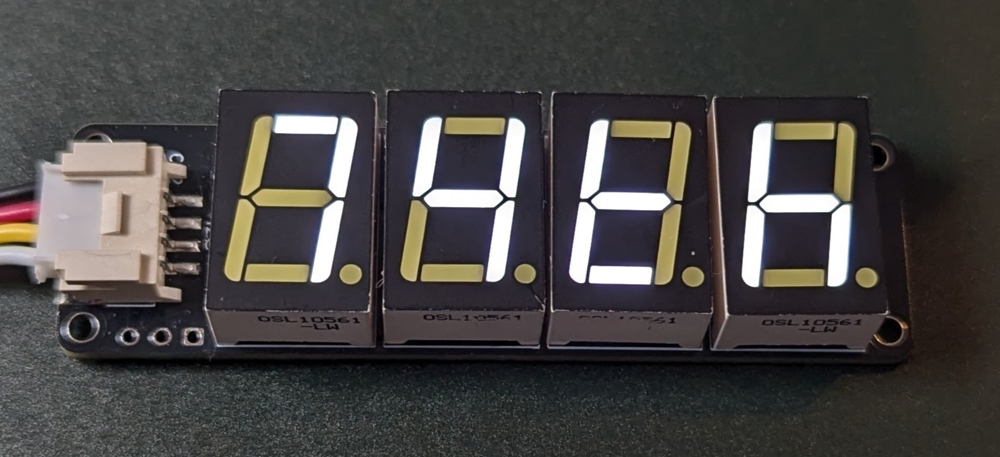
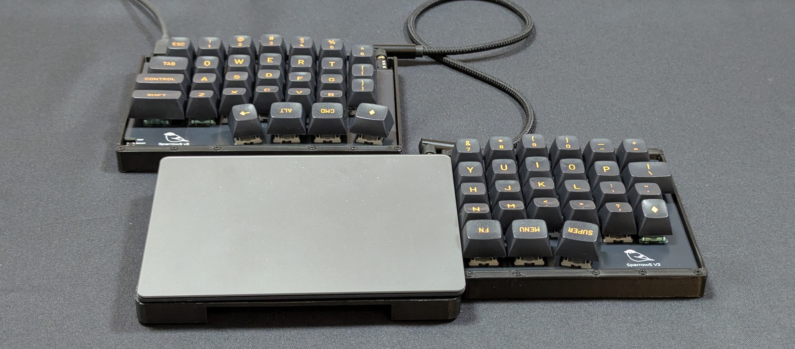

# 14. 筆者の製作

本書ではCH32V003のファームウェア開発について解説してきました。
最後に、筆者がCH32V003を組み込んだ作品を紹介します。

### CH32V003 ProMicro Like

ProMicro型の開発ボードを最初に作りました。
こちらは1章で紹介していますので、省略します。

キットは以下のページで販売しています。

> CH32V003 ProMicro Like Booth販売ページ [https://booth.pm/ja/items/4645948](https://booth.pm/ja/items/4645948)

OSHWとして、KiCadファイルを公開しています。

> KiCadファイル [https://github.com/74th/ch32v-dev-boards/tree/main/ch32v003-promicro](https://github.com/74th/ch32v-dev-boards/tree/main/ch32v003-promicro)

### StickPointV

自作キーボードで使えるジョイスティックデバイスとしてStickPointVを作りました。
ADCを使ってアナログジョイスティックを読み取り、I2Cスレーブデバイスとして自作キーボードのMCUに接続します。

<figure class="wide">

<figcaption>Stick Point V</figcaption>
</figure>

このような構造になっています。
ファームウェアはch32funを使って作りました。

<figure class="wide">

<figcaption>Stick Point Vの構造</figcaption>
</figure>

これを組み込んだ自作キーボードキットSparrow60Cを製作しました。

この製品は以下のページで販売しています。

> Booth販売ページ [https://74th.booth.pm/items/5404009](https://74th.booth.pm/items/5404009)

また、このファームウェアはOSSとして公開しています。

> firmware(OSS) [https://github.com/74th/stickpoint-firmware/tree/main/stickpointv-ch32v003j4m6](https://github.com/74th/stickpoint-firmware/tree/main/stickpointv-ch32v003j4m6)

この製作の詳細はブログ記事にまとめています。
ぜひ読んでみてください。

> ジョイスティックデバイスをQMK Firmwareに最適化させたStickPointを作った - @74thの制作ログ [https://74th.hateblo.jp/entry/tackpointv](https://74th.hateblo.jp/entry/tackpointv)

### USB切り替え機能付きUSBハブ Relay Switch Hub

<figure class="wide">

<figcaption>Relay Switch Hub</figcaption>
</figure>

メカニカルリレーを使ってホストの切り替え機能を追加したUSBハブを作りました。
このボタンでリレーを切り替える機能にCH32V003を使いました。

以下のような構造になっています。
本体とは別に、PCの前に配置できるリモートスイッチを作りました。
Groveケーブルを使って接続します。

<figure class="wide">

<figcaption>Relay Switch Hubの構成</figcaption>
</figure>

キットは以下のページで販売しています。

> Booth販売ページ [https://74th.booth.pm/items/5080690](https://74th.booth.pm/items/5080690)

KiCadファイルと、ファームウェアはOSHWとして公開しています。

> KiCadファイル、firmware(OSHW) [https://github.com/74th/relay-switch-usbhub](https://github.com/74th/relay-switch-usbhub)

この製作の詳細をブログ記事にまとめています。
ぜひ読んでみてください。

> Relayを使って、USB切り替え機能付きUSB Hubを安価に作った - @74thの制作ログ [https://74th.hateblo.jp/entry/2023/09/10/214059](https://74th.hateblo.jp/entry/2023/09/10/214059)

### SparrowTV

iPhoneケースに組み込んだTV横PC用の自作キーボードデバイスを作りました。

<figure class="wide">

<figcaption>SparrowTV</figcaption>
</figure>

SparrowTVはメインのMCUとしてESP32-C3を使っています。
USB HIDキーボード、マウスデバイスとしてIC CH9329を使用しています。
ESP32-C3では、キーボードを実現するほどのIOが足りないため、CH32V003をIOエキスパンダーとして組み込みました。
また、アナログジョイスティックの読み取りも行わせました。
サブMCUとして使うのにCH32V003は丁度良いと思っています。

以下が構成図となります。

<figure class="wide">

<figcaption>SparrowTVの構成</figcaption>
</figure>

キットは現在以下のページで販売中です。

> Booth販売ページ [https://74th.booth.pm/items/5309546](https://74th.booth.pm/items/5309546)

開発したKiCadファイル、ファームウェアはOSHWとして公開しています。

> KiCadファイル、firmware(OSHW) [https://github.com/74th/tv-side-keyboard-SparrowTV](https://github.com/74th/tv-side-keyboard-SparrowTV)

### USB Rebooter

USB Rebooterは、USBデバイスを定期的に電源オフによる再起動を行うデバイスです。

<figure class="wide">

<figcaption>USB Rebooter</figcaption>
</figure>

電源スイッチIC CH217をCH32V003で制御することで24時間毎に電源オンオフを行うものです。
CH32V003は安価であるため、簡易Timerとして使用しました。

<figure class="wide">

<figcaption>USB Rebooterの構成</figcaption>
</figure>

製品は残り少ないですが、以下のページで販売しています。

> Booth販売ページ [https://74th.booth.pm/items/5309546](https://74th.booth.pm/items/5309546)

開発したKiCadファイル、ファームウェアはOSHWとして公開しています。

> KiCadファイル、firmware(OSHW) [https://github.com/74th/usb-rebooter](https://github.com/74th/usb-rebooter)

この制作についてブログ記事にしています。
ぜひ読んでみてください。

> 時々ハングするIoT機器を再起動させるUSBアダプタを作った - @74thの制作ログ [https://74th.hateblo.jp/entry/usb-rebooter](https://74th.hateblo.jp/entry/usb-rebooter)

### USB Switch Adapter

<figure class="wide">

<figcaption>USB Switch Adapter</figcaption>
</figure>

電子工作をしていてブレッドボード上の回路を組み替えるときに、逐一マイコンボードのUSBを抜き差しするのが面倒です。
これをボタンでできるようにしたのがUSB Switch Adapterです。
CH32V003を組み込んで、長押しでUSBのオフにする機能を追加しました。

構成は以下のようになっています。

<figure class="wide">

<figcaption>USB Switch Adapterの構成</figcaption>
</figure>

この製品はBoothにて販売しています。

> Booth販売ページ [https://74th.booth.pm/items/6291652](https://74th.booth.pm/items/6291652)

また、KiCadファイル、ファームウェアはOSHWとして公開しています。

> KiCadファイル、firmware(OSHW) [https://github.com/74th/74th-oshw-projects/tree/main/74TH-G053-usb_switch_adapter](https://github.com/74th/74th-oshw-projects/tree/main/74TH-G053-usb_switch_adapter)

この制作についてブログ記事にしています。
ぜひ読んでみてください。

> 押しやすいスイッチでUSB電源を遮断するUSB Switch Adapterを作った - @74thの制作ログ [https://74th.hateblo.jp/entry/usb-switch-adapter](https://74th.hateblo.jp/entry/usb-switch-adapter)

### 自動ダウンロード付きESP32 Writer

<figure class="wide">

<figcaption>ESP32 Writer Pro CH9102</figcaption>
</figure>

ESP32は、BOOTピンとENピンを制御することでダウンロードモードに入れます。
これをUSBシリアル変換ICからMOSFETでその信号を作るのがよく行われますが、失敗することがあります。
これをCH32V003で余裕を持ったタイミングで制御することで、自動ダウンロード機能を実現するESP32プログラマを作りました。

USBシリアル変換ICにはCH9102を使っています。
構成は以下のようになります。

<figure class="wide">

<figcaption>ESP32 Writer Proの構成</figcaption>
</figure>

KiCadファイル、ファームウェアはOSHWとして公開しています。

> KiCad、firmware(OSHW) [https://github.com/74th/esp32-dev-boards/blob/main/ESP32-Writer-CH9102F](https://github.com/74th/esp32-dev-boards/blob/main/ESP32-Writer-CH9102F)

この制作についてブログ記事にしています。
ぜひ読んでみてください。

> ESP32の自動ダウンロードブート制御をマイコンで行うESP32 Writer Pro CH9102Fを作った - @74thの制作ログ [https://74th.hateblo.jp/entry/esp32-write-pro-ch9102](https://74th.hateblo.jp/entry/esp32-write-pro-ch9102)

### 7セグLEDデバイス 7 Seg Grove

<figure class="wide">

<figcaption>7Seg Grove</figcaption>
</figure>

7セグLED4個をGroveで接続できるデバイスにしました。
このI2Cスレーブと7セグLEDの制御にCH32V003を使いました。

筆者の家ではGroveポート付きESP32-C3ボード（『お家IoTリモコン全部作る（技術書典17）』で紹介したESP32-C3-IoT-Server）に繋がれ、リビングの湿度を常に表示するデバイスになっています。

このキットはBoothにて販売しています。

> Booth販売ページ [https://74th.booth.pm/items/6412203](https://74th.booth.pm/items/6412203)

また、KiCadファイル、ファームウェアはOSHWとして公開しています。

> KiCad、firmware(OSHW) [https://github.com/74th/74th-oshw-projects/blob/main/74TH-G060-7seg-grove](https://github.com/74th/74th-oshw-projects/blob/main/74TH-G060-7seg-grove)

この制作についてブログ記事にしています。
ぜひ読んでみてください。

> 7セグLEDを176個セット買ったので、Grove I2Cで制御して使うためのデバイスを作った - @74thの制作ログ [https://74th.hateblo.jp/entry/7seg-grove](https://74th.hateblo.jp/entry/7seg-grove)

### 左右分割型自作キーボードSparrowS v3

<figure class="wide">

<figcaption>SparrowS v3</figcaption>
</figure>

SparrowS v3は筆者の作成する分割自作キーボードのバージョン3です。
3Dプリンタでケースを出力し、ガスケットマウントというクッションでスイッチ、基板を受けとめる構造になっていて、打鍵感がマイルドになっています。
トラックパッドなどポインターデバイスを右手キーボードの近くに配置するのに効率的な形を目指しました。

RP2040をメインMCUとして左手側に配置し、CH32V003を右手側に配置し、その間はI2Cで接続しています。
その構成は以下のようになっています。

<figure class="wide">

<figcaption>SparrowS v3の構成</figcaption>
</figure>

このキットはBoothにて販売しています。

> Booth販売ページ [https://74th.booth.pm/items/6655442](https://74th.booth.pm/items/6655442)

RP2040上のQMK Firmwareの実装と、CH32V003のファームウェアはOSSとして公開しています。

> Sparrow keyboard series QMK Firmware fork [https://github.com/74th/qmk_firmware_sparrow_keyboard/tree/sparrow/keyboards/sparrow62/rev3](https://github.com/74th/qmk_firmware_sparrow_keyboard/tree/sparrow/keyboards/sparrow62/rev3)

> Sparrow Series Sub Firmware [https://github.com/74th/sparrow-keyboard-sub-firmware/](https://github.com/74th/sparrow-keyboard-sub-firmware/)

この制作についてブログ記事にしています。

> ガスケットマウント分割キーボードSparrowS v3を作って、エンドゲームに辿り着いた - @74thの制作ログ [https://74th.hateblo.jp/entry/sparrows-v3](https://74th.hateblo.jp/entry/sparrows-v3)
